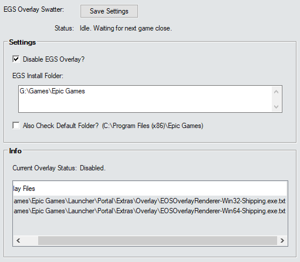

# EGS Overlay Swatter Addon

This is an AddOn that will disable or enable EGS overlay during offline stacking.

> [!CAUTION]
> *Obviously you should not use this addon if you're not running the game on the EGS platform.*

___



___

## How the AddOn works

The addon searches within the `EGS Install Folder` you have set for any files that look like the EGS Overlay files. If you have the addon set to disable the overlay - it will rename them - adding `.txt` on the end. This stops EGS from being able to find them.

If you choose to then enable the overlay again later - the addon can then undo the change - removing the `.txt` and EGS can find them again.

The reason for doing it this way is very specifically so disabling is not permanent. It can be undone - because in order to buy things in-game - you need to run the game with the overlay enabled.

The EGS Overlay files look like:  
```
EOSOverlayRenderer-Win32-Shipping.exe
EOSOverlayRenderer-Win64-Shipping.exe
```

> [!WARNING]
> *If you have previously DELETED the Overlay files (or renamed them in a different way) - obviously the addon will not be able to do anything to repair that. Updating the EGS Launcher or installing EGS games or even verifying some EGS games can force it to re-make the overlay files.*

> [!NOTE]
> *The addon can only enable or disable the overlay files while the game is closed.*

___

## Settings

### Disable EGS Overlay?

If this is ticked the addon will try to add `.txt` onto the overlay files to disable them during offline stacking.

If this is not ticked then it will try to remove the `.txt` from the overlay files to enable them during offline stacking.

### EGS Install Folder

Set this to wherever you installed the Epic Games Launcher. The default location on Windows tends to be `C:\Program Files (x86)\Epic Games`.

> [!CAUTION]
> *If your EGS install location is in Program Files or any other Windows protected folder - Script Hub will need to run with Admin privileges to modify the overlay files. This is non-negotiable.*

### Also Check Default Folder?

This will also check `C:\Program Files (x86)\Epic Games` if your EGS Install Folder is different.

> [!NOTE]
> *This should only be used if the overlay files in your EGS Install Folder are being renamed but the overlay is persisting. It will require admin privileges.*

___

## Info

This will simply display the status of the overlay files and has a list of which files the addon has been able to find.

___

## On Demand

This contains two buttons which will let you enable or disable the overlay files... well... on-demand. You press one of the buttons and the files get enabled/disabled.

You can use this to allow you to buy things in-game while the gem farm script is not running. Basically - close game - enable overlay - load game and buy something - close game - disable overlay - reload game and restart the script.

> [!WARNING]
> *These will not work if the game is on.*
