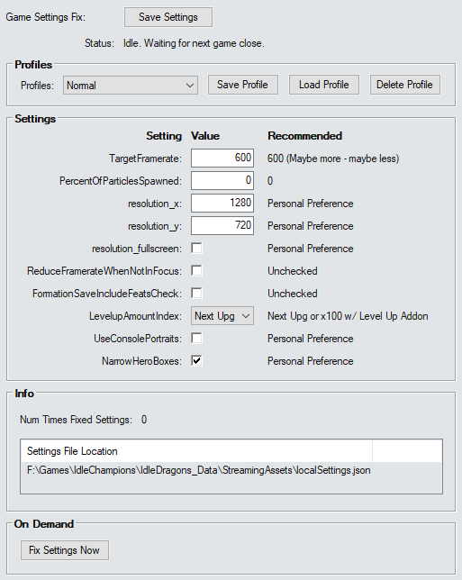

# Game Settings Fix Addon

There are various situations in which the game will overwrite any custom changes you've made to your `localSettings.json`. This usually happens when you visit the in-game settings menu and it resets FPS back to 60 and Particles back to 25. Sometimes even when the developers push updates they'll include their own settings which overwrite your own.

When this happens - your BPH will suffer. This is an AddOn for Script Hub that will try to fix the settings when that happens.

> [!NOTE]
> *This can only change the settings while the game is closed. So - typically during offline stacking - but it may also catch it if the Gem Farm script forces a game restart due to getting stuck or the like.*

___

___

## Profiles

Profiles allow the option to swap between different settings at will. This means you can save a setup where the game window is really tiny and fast and looks terrible in one profile while another profile could be a higher resolution or fullscreen to have better useability.

> [!NOTE]
> *Profiles are entirely optional. Using the `Save Settings` button at the top will continue to work and will set whatever you have saved as the current settings - even if you have no profiles saved.*

### Profile

A dropdown list of all profiles that currently exist.

### Save Profile

Saves the current settings to a new profile.

### Load Profile

Loads the settings of the selected profile.

### Delete Profile

Deletes the currently selected profile.

___

## Settings

### TargetFramerate

This sets the upper-limit for FPS for the game.

This should ideally be a number that your game can never reach - but not much higher than that. Too high and it can cause slowdowns. 600 is a good starting point.

Found in-game: `Settings -> Graphics -> Target Framerate`

### PercentOfParticlesSpawned

The graphics for some abilities can create other little graphical effects called particles. This sets the proportion of them that can be created.

This should ideally be on 0 at all times.

Found in-game: `Settings -> Graphics -> Particle Amount`

### resolution_x

The width of your game window in pixels.

Found in-game: `Settings -> Display -> Resolution`

### resolution_y

The height of your game window in pixels.

Found in-game: `Settings -> Display -> Resolution`

### reolution_fullscreen

Determines whether the game covers the entire screen or not.

Found in-game: `Settings -> Display -> Fullscreen`

### ReduceFramerateWhenNotInFocus

This will limit the fps of the game (and therefore slow it down) while it's hidden behind other windows.

This should ideally be off at all times.

Found in-game: `Settings -> Graphics -> Reduce framerate when in background`

### FormationSaveIncludeFeatsCheck

Determines whether a formation save will have feats included or not when saved.

Ideally you should never save feats to formation as they lag formation swapping - which scripting does a lot of. The only exception is when using Feat Swap routes - and even then you only save feats to the formation on Briv.

Found in-game: `Formation Manager -> Include currently equipped Feats with save`

### LevelupAmountIndex

Determines how champions are levelled up.

If you are not using the level up addon - you should be using `Next Upg` as any other method can level above softcap and not only lag the game - but also potentially steal gold from click damage levelups.

If you are using the level up addon then x100 is the best option.

Found in-game: `Level Up Button (Left of BUD/Ultimate bar)`

### UseConsolePortraits

Determines whether the portraits for the champions on the bench are the creepy ones that stare into your soul or not.

It is recommended that these die by fire and never see the light of day. But - you do you.

Found in-game: `Settings -> Interface -> Console UI Portraits`

### NarrowHeroBoxes

Determines whether you can see all champions on the bench on low resolutions or not.

Ironically they actually increase the size of the champion portraits on higher resolution because the game no longer needs to render the left and right scroll arrows on either side.

Found in-game: `Settings -> Interface -> Narrow Bench Boxes`

___

## Info

Just a bit of information telling you how many times the addon has fixed your settings for you during the current session - and the location of your settings file in-case you wish to make any other changes yourself.

___

## On Demand

This contains a button which will let you fix the settings... well... on-demand. You press the button - the settings get fixed.

> [!WARNING]
> *This will not work if the game is on.*