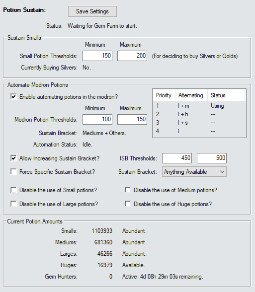

# Potion Sustain Addon

This is an AddOn for Script Hub that will try to sustain your potions as best it can. It does this through two separate methods.

> [!WARNING]
> *This addon requires Script Hub version 4. If you have not updated to that version - this addon will **not** work.*

___

___

## Sustain Smalls

The first section of the AddOn will attempt to sustain Small Potions of Speed by occasionally buying Silver chests.

It defaults to always buying Gold chests until your small potion count falls below the Small Potion Threshold Minimum - at which point it will start buying Silver chests to restock. It will then continue buying Silvers until your small potion count goes back above the Small Potion Threshold Maximum - at which point it will go back to buying Golds.

To do this - the AddOn completely ignores the four Buy and Open settings in the `Briv Gem Farm` addon. It acts like they are all on. It will - however - continue to follow the `Maintain this many gems when buying chests.` setting.

### Small Potion Thresholds (Minimum)

When the small potion amount drops to or below this threshold - the addon will start buying Silver Chests.
 
### Small Potion Thresholds (Maximum)

If the addon is currently buying Silver chests and the small potion amount increases to or above this threshold - it will start buying Gold Chests again.

___

## Automate Modron Potions

The second section gives the option to have the AddOn change the potions in your modron - allowing you to alternate between potion types automatically.

It runs on a similar process that Sustaining Smalls does. When a potion type falls below the minimum threshold it can no longer be used and the addon will switch to a different combination. When that same potion type goes back above the maximum threshold it will be available for use again.

The interface will tell you which Alternating combination it's currently using.

> [!NOTE]
> *Please be aware that it can only change the potions in the modron during offline stacking - so this will not work at all for purely online runs.*

### Enable automating potions in the modron?

This will tell the addon to start automatically changing the potions set in the modron. It can only do this while the game is off during offline stacking.

### Modron Potion Thresholds (Minimum)

When a potion type amount drops to or below this threshold - the addon will make this potion type unavailable so it can restock.
 
### Modron Potion Thresholds (Maximum)

If a potion type is not being used so it can restock and the amount of that potion increases to or above this threshold - the addon will make it available for use again.

### Allow Increasing Sustain Bracket?

This is a checkbox that will allow the addon to temporarily increase your sustain bracket if the amount of potions for higher brackets exceeds a higher threshold. The minimum for this threshold is three times your Automation Maximum Threshold.

> [!NOTE]
> *`Allow Increasing Sustain Bracket` is mutually exclusive with `Force Specific Sustain Bracket`.*

### Increasing Sustain Bracket Thresholds (Minimum)

When a potion type amount drops to or below this threshold - the addon will no longer be able to Increase Sustain Bracket to that potion type.
 
### Increasing Sustain Bracket Thresholds (Maximum)

When a potion type amount increases to or above this threshold - the addon will be able to Increase Sustain Bracket to this potion type.

### Force Specific Sustain Bracket?

This is a checkbox that will force the addon to use a specific sustain bracket. It will only ever automate potion priorities within this bracket - even if you cannot sustain that bracket.

The purpose of this setting is so that people who have bought 4 Event Boons can alternate single potions with the `Anything Available` bracket and thereby not waste potions.

> [!CAUTION]
> *You should only use this setting if you actually know that you need it and why.  
> I will not be held liable for idiots who set a sustain bracket higher than they can support.*

> [!NOTE]
> *`Force Specific Sustain Bracket` is mutually exclusive with `Allow Increasing Sustain Bracket`.*

### Disable the use of [Type] Potions

These four checkboxes quite literally prevent the addon from being able to automate the selected potion types. It's generally not recommended to use these settings unless you have a very good reason for doing so.

___

## Sustain Brackets

The addon determines which combinations of potions to use based on your current modron `Reset Zone`.

For the time being it's extremely simplistic - and might not be good for everyone - but it's the best I can do for now. I may try more complicated alternatives at a later date.

> [!WARNING]
> *This addon does not automatically adjust Sustain Bracket based on Event Boons.*

> [!NOTE]
> *Speeds below include the Modron node as well as Hew Maan's feat and the Potent Potions blessing.*

### Mediums + Others

z1185 (or z895 with Gem Hunter) can permanently sustain medium potions - if the script can buy Silvers occasionally to sustain smalls. (Which is why Sustain Smalls is not optional.)

| Alternatives | Uptime | Speed No Shandie | Speed Shandie |
|---|--:|--:|--:|
| Medium + Large | 40.09%+ | x10 | x10 |
| Medium + Huge | 5.02%+ | x10 | x10 |
| Medium + Small | 100% | x5.64 | x8.46 |

### Smalls + Others

z665 (or z480 with Gem Hunter) can permanently sustain small potions.

| Alternatives | Uptime | Speed No Shandie | Speed Shandie |
|---|--:|--:|--:|
| Small + Large | 23.27%+ | x7.25 | x10 |
| Small + Huge | 0.82%+ | x8.86 | x10 |
| Small + Medium | 58.17%+ | x5.64 | x8.46 |
| Small only | 100% | x2.58 | x3.87 |

### Anything Available

Below z665 (or z480 with Gem Hunter) you can't permanently sustain any potion. Because of this it will use 1 potion at a time and alternate all 4 types.

| Alternatives | Uptime | Speed No Shandie | Speed Shandie |
|---|--:|--:|--:|
| Large | 0%+ | x4.64 | x6.96 |
| Huge | 0%+ | x5.67 | x8.51 |
| Medium | 0%+ | x3.61 | x5.41 |
| Small | 0%+ | x2.58 | x3.87 |

___

## Current Potion Amounts

This is simply an informative display that lets you know the status of each potion type. How many you have and whether they're available or not or blocked. It will even display your Gem Hunter Potion status.
